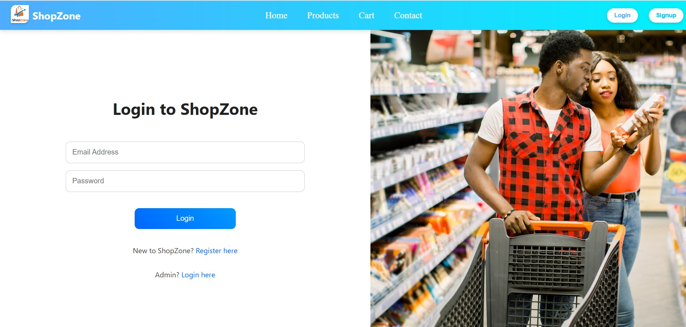
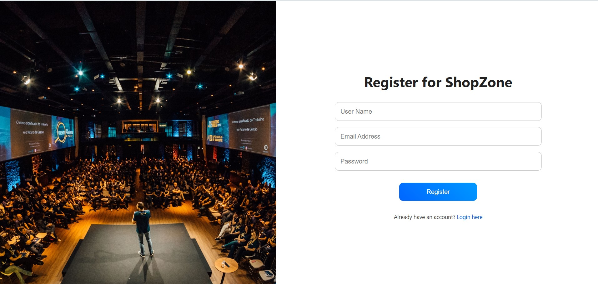
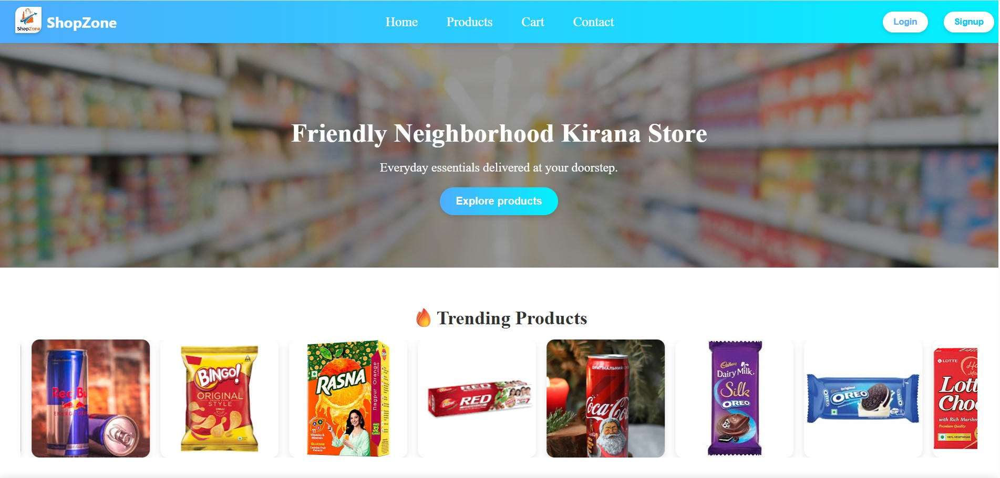
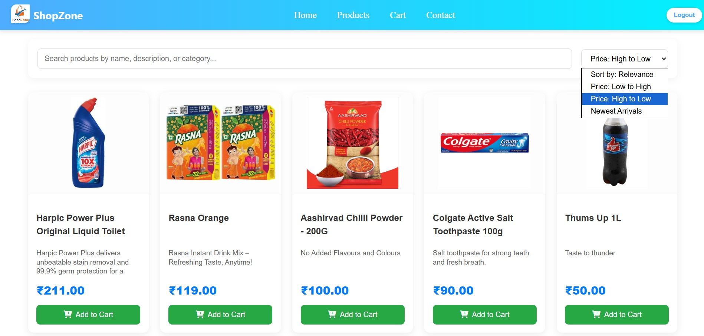
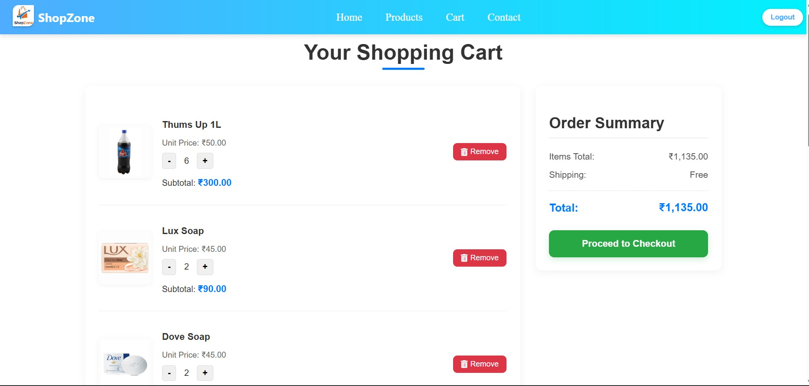
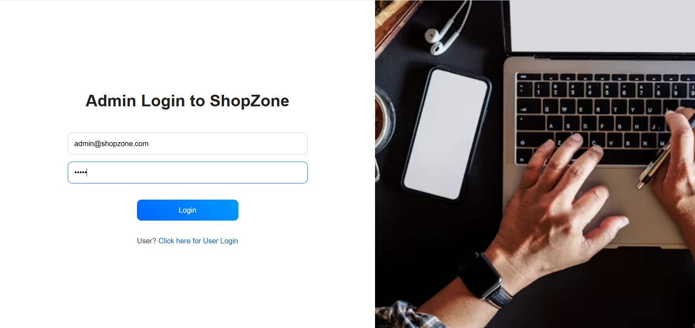
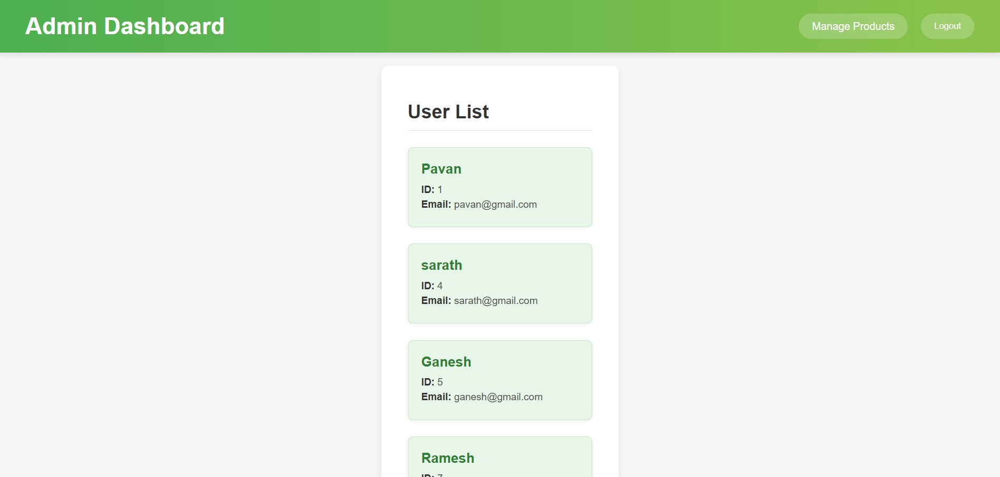
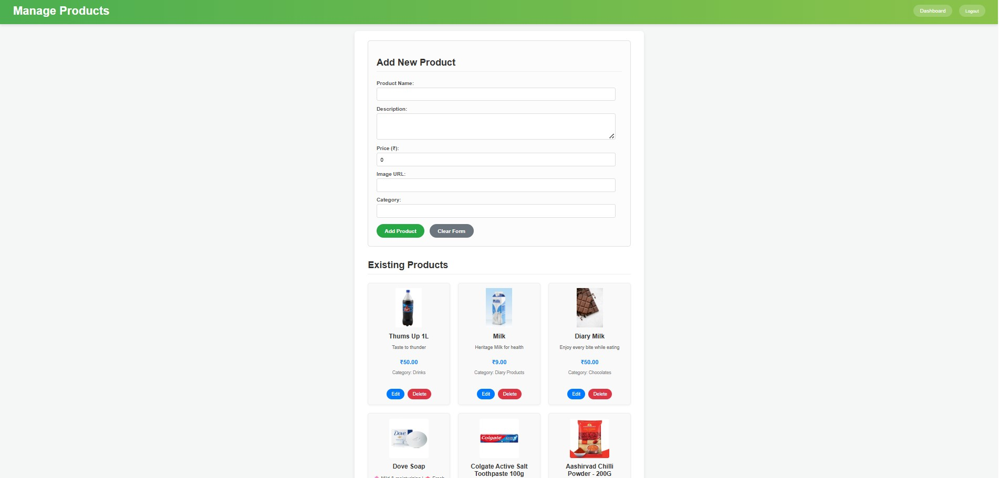

#  ShopZone - Your Friendly Neighborhood Online Store

Welcome to **ShopZone**, a full-stack e-commerce application designed to provide a seamless shopping experience for everyday essentials. From Browse products to managing cart and handling administrative tasks, ShopZone aims to be your go-to online kirana store.

---

## ✨ Features

* **User Authentication:** Secure registration and login for customers.
* **Admin Panel:** Dedicated login and dashboard for administrators to manage products and users.
* **Product Catalog:** Browse a wide range of products with search, filter, and sort functionalities.
* **Shopping Cart:** Add, update quantities, and remove items from cart.
* **Responsive Design:** Optimized for a smooth experience across various devices (desktop, tablet, mobile).
* **RESTful API:** Robust backend providing clean and efficient data management.
* **Database Integration:** Persistent storage for users, products, carts, and cart items.

---

## 🚀 Technologies Used

This project is built using a modern full-stack architecture:

### Frontend
* **Angular:** A powerful framework for building dynamic single-page applications.
* **TypeScript:** Superset of JavaScript for type-safe development.
* **HTML5 & CSS3:** For structuring and styling the web pages.
* **Font Awesome:** For scalable vector icons.
* **RxJS:** For reactive programming.

### Backend
* **Spring Boot:** A robust framework for building production-ready, stand-alone Spring applications.
* **Java:** The core programming language.
* **Spring Data JPA:** For easy database interaction.
* **Spring Security:** For authentication and authorization.
* **Lombok:** To reduce boilerplate code (getters, setters, constructors).
* **MySQL:** In-memory or relational database for data persistence.
* **Maven:** For dependency management and project build.

---

## 📂 Folder Structure

The project is divided into two main parts: `Frontend` (Angular) and `Backend` (SpringBoot).
```
ShopZone/
├── .vscode/
├── Backend/
│   ├── .vscode/
│   └── ShopZone-SpringBoot/
│       ├── .mvn/
│       │   └── wrapper/
│       ├── src/
│       │   ├── main/
│       │   │   ├── java/
│       │   │   │   └── com/
│       │   │   │       └── example/
│       │   │   │           └── ShopZone/
│       │   │   │               ├── config/
│       │   │   │               │   ├── crossConfig.java
│       │   │   │               │   └── SecurityConfig.java
│       │   │   │               ├── controller/
│       │   │   │               │   └── ShopZoneController.java
│       │   │   │               ├── dto/
│       │   │   │               │   ├── AdminLoginDTO.java
│       │   │   │               │   ├── CartItemDTO.java
│       │   │   │               │   ├── CartItemUpdateDTO.java
│       │   │   │               │   ├── LoginDTO.java
│       │   │   │               │   ├── ProductDTO.java
│       │   │   │               │   └── RegisterDTO.java
│       │   │   │               ├── Exceptions/
│       │   │   │               ├── model/
│       │   │   │               │   ├── Cart.java
│       │   │   │               │   ├── CartItem.java
│       │   │   │               │   ├── Products.java
│       │   │   │               │   └── User.java
│       │   │   │               ├── repository/
│       │   │   │               │   ├── CartItemRepository.java
│       │   │   │               │   ├── CartRepository.java
│       │   │   │               │   ├── ProductRepository.java
│       │   │   │               │   └── UserRepository.java
│       │   │   │               └── service/
│       │   │   │                   ├── ShopZoneService.java
│       │   │   │                   └── ShopZoneApplication.java
│       │   │   └── resources/
│       │   │       ├── static/
│       │   │       ├── templates/
│       │   │       └── application.properties
│       │   └── test/
│       ├── .gitattributes
│       ├── .gitignore
│       ├── HELP.md
│       ├── mvnw
│       ├── mvnw.cmd
│       ├── pom.xml
├── Frontend/
│   └── ShopZone-Angular/
│       ├── .angular/
│       ├── .vscode/
│       ├── node_modules/
│       ├── public/
│       ├── src/
│       │   ├── app/
│       │   │   ├── AdminComponents/
│       │   │   │   ├── admin/
│       │   │   │   │   ├── admin.css
│       │   │   │   │   ├── admin.html
│       │   │   │   │   ├── admin.spec.ts
│       │   │   │   │   └── admin.ts
│       │   │   │   ├── admin-home/
│       │   │   │   │   ├── admin-home.css
│       │   │   │   │   ├── admin-home.html
│       │   │   │   │   ├── admin-home.spec.ts
│       │   │   │   │   └── admin-home.ts
│       │   │   │   └── admin-products/
│       │   │   │       ├── admin-products.css
│       │   │   │       ├── admin-products.html
│       │   │   │       ├── admin-products.spec.ts
│       │   │   │       └── admin-products.ts
│       │   │   ├── PagesComponents/
│       │   │   │   ├── cart/
│       │   │   │   │   ├── cart-service.spec.ts
│       │   │   │   │   ├── cart.css
│       │   │   │   │   ├── cart.html
│       │   │   │   │   ├── cart.spec.ts
│       │   │   │   │   └── cart.ts
│       │   │   │   ├── contact/
│       │   │   │   │   ├── contact.css
│       │   │   │   │   ├── contact.html
│       │   │   │   │   ├── contact.spec.ts
│       │   │   │   │   └── contact.ts
│       │   │   │   ├── home/
│       │   │   │   │   ├── home.css
│       │   │   │   │   ├── home.html
│       │   │   │   │   ├── home.spec.ts
│       │   │   │   │   └── home.ts
│       │   │   │   ├── login/
│       │   │   │   │   ├── login.css
│       │   │   │   │   ├── login.html
│       │   │   │   │   ├── login.spec.ts
│       │   │   │   │   └── login.ts
│       │   │   │   ├── products/
│       │   │   │   │   ├── products.css
│       │   │   │   │   ├── products.html
│       │   │   │   │   ├── products.spec.ts
│       │   │   │   │   └── products.ts
│       │   │   │   └── signup/
│       │   │   │       ├── signup.css
│       │   │   │       ├── signup.html
│       │   │   │       ├── signup.spec.ts
│       │   │   │       └── signup.ts
│       │   │   ├── ReusableComponents/
│       │   │   │   ├── footer/
│       │   │   │   │   ├── footer.css
│       │   │   │   │   ├── footer.html
│       │   │   │   │   ├── footer.spec.ts
│       │   │   │   │   └── footer.ts
│       │   │   │   └── navbar/
│       │   │   │       ├── navbar.css
│       │   │   │       ├── navbar.html
│       │   │   │       ├── navbar.spec.ts
│       │   │   │       └── navbar.ts
│       │   │   ├── app.config.server.ts
│       │   │   ├── app.config.ts
│       │   │   ├── app.css
│       │   │   ├── app.html
│       │   │   ├── app.routes.server.ts
│       │   │   ├── app.routes.ts
│       │   │   ├── app.spec.ts
│       │   │   ├── app.ts
│       │   │   └── data-service.ts
│       │   ├── assets/
│       │   │   ├── AjayBrush.jpg
│       │   │   ├── Bingo.jpg
│       │   │   ├── Britannia.jpg
│       │   │   ├── ChocoPie.jpg
│       │   │   ├── Cococola.jpg
│       │   │   ├── dabur.jpg
│       │   │   ├── dairymilk.jpg
│       │   │   ├── MysoreSandal.jpg
│       │   │   ├── NatarajPencils.jpg
│       │   │   ├── oreo.jpg
│       │   │   ├── RedBull.jpg
│       │   │   ├── ShopZone Logo.png
│       │   │   ├── ShoZone_banner.jpg
│       │   │   ├── TajMahal.jpg
│       │   │   └── .....
│       │   ├── index.html
│       │   ├── main.server.ts
│       │   ├── main.ts
│       │   ├── server.ts
│       │   └── styles.css
│       ├── .editorconfig
│       ├── .gitignore
│       ├── angular.json
│       ├── package-lock.json
│       ├── package.json
│       ├── README.md
│       ├── tsconfig.app.json
│       ├── tsconfig.json
│       └── tsconfig.spec.json

```

---


## 🛠️ Setup and Installation

Follow these steps to get ShopZone up and running on your local machine.

### Prerequisites

* **Java Development Kit (JDK) 17 or higher**
* **Maven 3.6.x or higher**
* **Node.js 18.x or higher**
* **npm 9.x or higher (comes with Node.js)**
* **Angular CLI (install globally):**

    ```bash
    npm install -g @angular/cli
    ```
* **A database:** H2 (in-memory, default for quick start), or MySQL.

### Backend Setup (Spring Boot)

1.  **Navigate to the backend directory:**
    ```bash
    cd Backend/ShopZone-SpringBoot
    ```
2.  **Configure Database (for persistent data with MySQL):**
    First, ensure you have the MySQL JDBC driver dependency in your `pom.xml` (located in `Backend/ShopZone-SpringBoot/pom.xml`):

    ```xml
    <dependency>
        <groupId>com.mysql</groupId>
        <artifactId>mysql-connector-j</artifactId>
        <version>8.0.33</version> </dependency>
    ```
    Then, modify `src/main/resources/application.properties` with your MySQL database details:

    ```properties
    spring.datasource.url=jdbc:mysql://localhost:3306/shopzone_db?useSSL=false&serverTimezone=UTC
    spring.datasource.username=your_mysql_username
    spring.datasource.password=your_mysql_password
    spring.jpa.hibernate.ddl-auto=update # or create, create-drop (use 'update' for existing schema, 'create' for new)
    spring.jpa.show-sql=true
    spring.jpa.properties.hibernate.dialect=org.hibernate.dialect.MySQLDialect
    ```
    **Important:**
    * Replace `your_mysql_username` and `your_mysql_password` with your actual MySQL credentials.
    * Ensure a database named `shopzone_db` (or whatever you choose) exists in your MySQL server. You might need to create it manually: `CREATE DATABASE shopzone_db;`
    * Set `spring.jpa.hibernate.ddl-auto` to `update` (recommended after initial setup) or `create` if you want Hibernate to generate the schema for you on startup. Be cautious with `create` as it drops and recreates tables, leading to data loss.

3.  **Build the project:**
    ```bash
    mvn clean install
    ```
4.  **Run the Spring Boot application:**
    ```bash
    mvn spring-boot:run
    ```
    The backend will start on `http://localhost:8080`.
### Frontend Setup (Angular)

1.  **Navigate to the frontend directory:**
    ```bash
    cd Frontend/ShopZone-Angular
    ```
2.  **Install dependencies:**
    ```bash
    npm install
    ```
3.  **Run the Angular development server:**
    ```bash
    ng serve --open
    ```
    The Angular application will open in your browser at `http://localhost:4200`.

---

## 👨‍💻 Usage

### User Accounts

* **Register:** Navigate to `/signup` to create a new user account.
* **Login:** Access the user login page at `/login`.
    * **Default User (for testing):** After registration, use the credentials you signed up with.
* **Browse Products:** Once logged in (or even as a guest), explore the products at `/products`.
* **Add to Cart:** Add desired products to your shopping cart.
* **Manage Cart:** View and modify items in your cart at `/cart`.

### Admin Accounts

* **Admin Login:** Access the admin login page at `/admin`.
    * **Default Admin Credentials:**
        * **Email:** `admin@shopzone.com`
        * **Password:** `admin` (We need to give in cd Backend/ShopZone-SpringBoot/ShopZoneController.java as default credentials)
* **Admin Dashboard:** After logging in, we'll be redirected to `/admin-home` where we can view registered users.
* **Manage Products:** Navigate to `/admin-products` to add, edit, or delete products.

---

## 📸 Screenshots

Here are some glimpses of the ShopZone application:

### User Login Page
The entry point for customers to access their accounts.


### User Registration Page
New users can easily create an account.


### Home Page
A welcoming landing page featuring trending products.


### Products Page
Browse and search through a wide array of products.


### Shopping Cart
Review and manage items before checkout.


### Admin Login Page
Dedicated access for administrators.


### Admin Dashboard
Overview of registered users and quick stats.


### Admin Product Management
Add, edit, and delete products with ease.


---

## 📡 API Endpoints (Backend)

Here's a summary of the main REST API endpoints provided by the Spring Boot backend:

| Method | Endpoint                    | Description                                         | Authentication Required | Role |
| :----- | :-------------------------- | :-------------------------------------------------- | :---------------------- | :--- |
| `POST` | `/register`                 | Register a new user.                                | No                      | N/A  |
| `POST` | `/login`                    | Authenticate a user and return success message/ID.  | No                      | N/A  |
| `POST` | `/admin`                    | Authenticate an admin.                              | No                      | N/A  |
| `GET`  | `/users`                    | Get all users (Admin only) or by email (`?email=`). | Yes                     | ADMIN (for all), Authenticated (for specific email) |
| `GET`  | `/users/{id}`               | Get user details by ID.                             | Yes                     | Any Authenticated User |
| `PUT`  | `/users/{id}`               | Update user details by ID.                          | Yes                     | Authenticated User (for self), ADMIN |
| `DELETE`| `/users/{id}`               | Delete user by ID.                                  | Yes                     | ADMIN |
| `POST` | `/products`                 | Add a new product.                                  | Yes                     | ADMIN |
| `GET`  | `/products`                 | Get all products.                                   | No                      | N/A  |
| `GET`  | `/products/{id}`            | Get product details by ID.                          | No                      | N/A  |
| `PUT`  | `/products/{id}`            | Update product details by ID.                       | Yes                     | ADMIN |
| `DELETE`| `/products/{id}`            | Delete product by ID.                               | Yes                     | ADMIN |
| `POST` | `/cartitems`                | Add an item to the user's cart.                     | Yes                     | Any Authenticated User |
| `GET`  | `/cartitems/user/{userId}`  | Get all cart items for a specific user.             | Yes                     | Any Authenticated User |
| `PUT`  | `/cartitem/{id}`            | Update quantity of a cart item by its ID.           | Yes                     | Any Authenticated User |
| `DELETE`| `/cartitem/{id}`            | Remove a cart item by its ID.                       | Yes                     | Any Authenticated User |
| `GET`  | `/cart`                     | Get all carts (Admin only).                         | Yes                     | ADMIN |
| `GET`  | `/cart/{id}`                | Get cart details by ID.                             | Yes                     | ADMIN |
| `PUT`  | `/cart/{id}`                | Update cart by ID.                                  | Yes                     | ADMIN |
| `DELETE`| `/cart/{id}`                | Delete cart by ID.                                  | Yes                     | ADMIN |

---

## 🗄️ Database Schema

The application uses the following main entities:

### `User`
* `id` (Primary Key, Long, Auto-Generated)
* `name` (String)
* `email` (String, Unique)
* `password` (String, Hashed)
* `cart` (OneToOne relationship with `Cart`)

### `Products`
* `id` (Primary Key, Long, Auto-Generated)
* `name` (String)
* `description` (String)
* `price` (Double)
* `imageUrl` (String)
* `category` (String)

### `Cart`
* `id` (Primary Key, Long, Auto-Generated)
* `user` (OneToOne relationship with `User`)
* `cartItems` (OneToMany relationship with `CartItem`)

### `CartItem`
* `id` (Primary Key, Long, Auto-Generated)
* `cart` (ManyToOne relationship with `Cart`)
* `products` (ManyToOne relationship with `Products`)
* `quantity` (Integer)

---

## 💡 Future Enhancements

* **Order Management:** Implement full order placement, history, and tracking.
* **Payment Gateway Integration:** Integrate with popular payment services (e.g., PhonepPe, PayPal, GooglePay,...).
* **Advanced Search & Filtering:** More sophisticated product search capabilities (e.g., by brand, price range).
* **Product Reviews & Ratings:** Allow users to review products.
* **User Profiles:** More detailed user profiles and settings.
* **Wishlist Functionality:** Enable users to save products to a wishlist.
* **JWT Authentication:** Replace basic authentication with JWT for enhanced security in the frontend.
* **Deployment:** Set up deployment to cloud platforms (e.g., AWS, GCP, Heroku, Vercel, e.t.c.).

---

## 🤝 Contributing

Contributions are welcome! If you have suggestions, bug reports, or want to contribute code, please feel free to:

1.  Fork the repository.
2.  Create a new branch (`git checkout -b feature/your-feature-name`).
3.  Make your changes.
4.  Commit your changes (`git commit -m 'Add new feature'`).
5.  Push to the branch (`git push origin feature/your-feature-name`).
6.  Open a Pull Request.

---

## 📧 Contact

For any questions or inquiries, please reach out to:

* **Your Name:** Pavan Kumar Pedamallu
* **Your Email:** pavank0066@gmail.com
* **Project Link:** https://github.com/Pavan-441/ShopZone-Website
